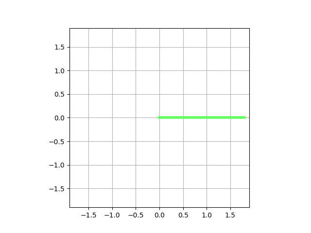

# 2DOF_Planar_Arm_Trajectory_Planning

This project demonstrates joint-space and Cartesian-space trajectory planning for a planar 2-DOF robotic arm in Python. Linear and cubic time scaling are used to generate smooth motion between target positions, with results visualized through animated simulations.

## Features
- Joint-space trajectory planning using custom forward and inverse kinematics from a previous 2-DOF arm kinematics project
- Cartesian-space trajectory planning using the same kinematic solvers
- Matplotlib-based animation functions to visualise motion between end-effector targets
- Linear and cubic time scaling for both trajectory planning methods

## Demo

**Joint-space trajectory planning (linear time scaling)


**Joint-space trajectory planning (cubic time scaling)  


**Cartesian-space trajectory planning (cubic time scaling)  


## Example usage
```python
# Joint Space

start_thetas = [0.0, 0.0]
target = [1.2, 0.5]
lengths = [1.0, 0.8]
steps = 60
traj = trajectory_joint_space(start_thetas, target, lengths, steps, mode="cubic")

animate_2dof(traj, lengths)

# Cartesian Space

start_thetas = [0.0, 0.0]
target = [1.2, 0.5]
lengths = [1.0, 0.8]
steps = 60
traj = trajectory_cartesian(start_thetas, target, lengths, steps, mode="cubic")

animate_2dof(traj, lengths)

